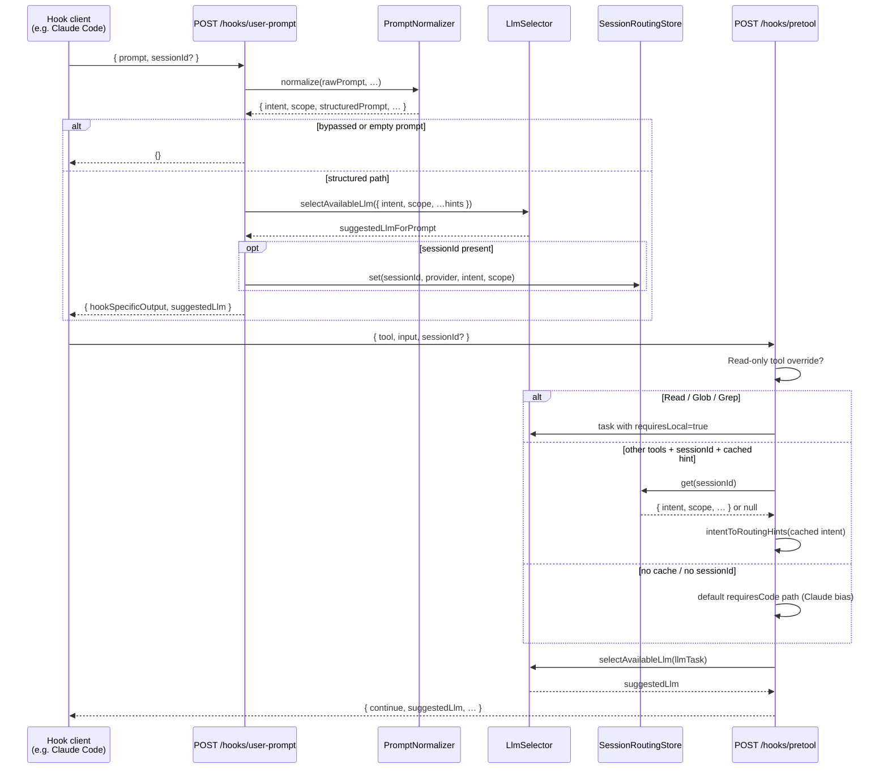
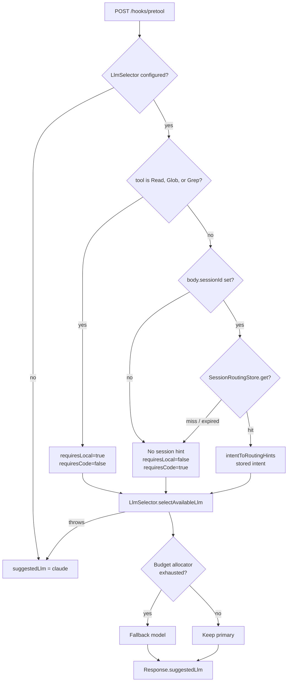
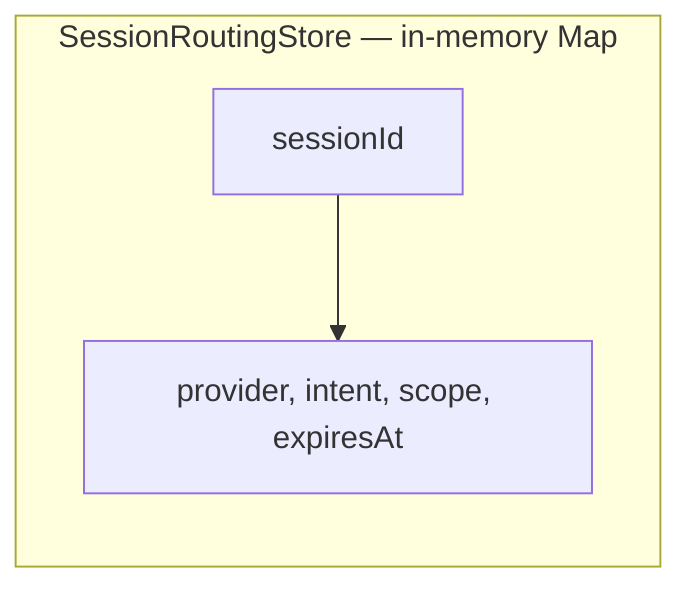

# Intent-based LLM routing (Gen hooks)

Gen recommends which **LLM provider** (`claude`, `ollama`, etc.) should handle the next model work for a session. Routing combines:

1. **Prompt normalization** — `PromptNormalizer` classifies each user message into an **`IntentClass`** and **`ScopeLevel`**.
2. **`intentToRoutingHints()`** — maps intent to `requiresLocal` / `requiresCode` flags consumed by **`LlmSelector`**.
3. **`SessionRoutingStore`** — in-memory cache (5-minute TTL) keyed by **`sessionId`**, so **`/hooks/pretool`** can reuse the intent from the latest **`/hooks/user-prompt`** for that session.

All routing paths are **fail-open**: failures fall back to **`claude`**.

**Observability:** OTLP traces, counters, optional SQLite `routing_decisions`, and learning `task_outcomes` extensions — full reference **[`docs/agent-observability/GEN-OTEL.md`](../../docs/agent-observability/GEN-OTEL.md)**. Operator queries: **[`META-ROUTING-DASHBOARD.md`](META-ROUTING-DASHBOARD.md)**.

---

## Observability

OpenTelemetry attribute keys live in [`gen/src/otel/attributes.ts`](../src/otel/attributes.ts) as `GEN_ATTRS`.

| Signal | Where | Fields |
|--------|--------|--------|
| **Span** | `hook.pretool` (decision `allow`) | `gen.suggested_llm`, `gen.pretool_routing_source`, `gen.routing_reconciliation`, `gen.session_routing_hit`, optional `gen.session_hint_age_bucket`, `gen.actual_llm`, `gen.policy_layer` |
| **Span** | `hook.user-prompt` | `gen.prompt_normalizer_version` on span start; `structure`: `gen.suggested_llm`, `gen.intent`, `gen.scope` |
| **Span** | `hook.posttool` | `gen.intent_tool_coherence`, optional `gen.actual_llm`, optional `gen.suggested_llm` (client echo), `gen.policy_layer` |
| **Span** | All hooks | W3C **`traceparent`** extracted from request when present — parents hook spans under client trace |
| **Metrics** | OTel meter | `gen.routing_reconciliation`, `gen.user_prompt_bypass`, session store observable gauges — see GEN-OTEL.md |
| **SQLite** | Main DB | Table **`routing_decisions`** (append-only audit); **`task_outcomes`** optional `prompt_intent`, `active_llm`, `suggested_llm` |
| **ObservabilityLogger** | `pretool` | `routing_reconciliation`, `routing_rationale`, optional `actual_llm`, `session_hint_age_bucket` |
| **ObservabilityLogger** | `posttool` | `intent_tool_coherence`, optional `active_llm`, `suggested_llm_echo` |

**`gen.pretool_routing_source` values:** `read_only_tool` (Read/Glob/Grep override), `session_intent` (cache hit from user-prompt), `default` (no cache / Claude-biased hints), `error_fallback` (selector threw), `selector_unavailable` (`LlmSelector` not initialized — common in minimal tests).

---

## Visual overview

### End-to-end sequence (happy path)



### Pretool routing decision (flowchart)



### User-prompt branch (flowchart)

```mermaid
flowchart TD
  A[POST /hooks/user-prompt] --> B{GEN_DISABLE_PROMPT_NORMALIZER?}
  B -->|true| Z[Return {}]
  B -->|false| C{prompt non-empty string?}
  C -->|no| Z
  C -->|yes| D[PromptNormalizer.normalize]
  D --> E{bypassed?}
  E -->|yes| Z
  E -->|no| F{LlmSelector configured?}
  F -->|no| G[suggestedLlm = claude]
  F -->|yes| H[selectAvailableLlm from<br/>intentToRoutingHints intent]
  H -->|throws| G
  H -->|ok| I[resolved provider]
  G --> J
  I --> J{sessionId in body?}
  J -->|yes| K[SessionRoutingStore.set]
  J -->|no| L[Skip store — pretool<br/>cannot recover session intent]
  K --> M[JSON response + suggestedLlm]
  L --> M
```

### Data retained per session (entity view)



---

## Intent → routing hints

| Intent class | `requiresLocal` | `requiresCode` | Typical `LlmSelector` bias |
|--------------|-----------------|----------------|----------------------------|
| `explore` | true | false | Local (e.g. Ollama) when available |
| `status` | true | false | Local |
| `manage` | true | false | Local |
| `trigger` | true | false | Local |
| `schedule` | true | false | Local |
| `code` | false | true | Claude / code-capable cloud |
| `dispatch` | false | true | Claude / code-capable cloud |

Implementation: [`gen/src/llm/llm-selector.ts`](../src/llm/llm-selector.ts) — `intentToRoutingHints()`.  
The switch includes a **`never`** exhaustive default so new `IntentClass` values force a compile-time update.

---

## Session store

| Property | Value |
|----------|--------|
| **TTL** | 5 minutes (`TTL_MS` in [`session-routing-store.ts`](../src/routing/session-routing-store.ts)) |
| **Eviction** | On **`set()`**: remove all expired entries. On **`get()`**: delete and return `null` if expired. |
| **Scope** | Single Node process — not shared across Gen replicas unless you add external state. |
| **Stored fields** | `provider`, `intent`, `scope`, `setAt`, `expiresAt` |

---

## API contract (routing-relevant fields)

### `POST /hooks/user-prompt`

**Request (subset):**

| Field | Type | Role |
|-------|------|------|
| `prompt` | string | Required for normalization. |
| `sessionId` | string (optional) | If omitted, **no** routing hint is stored; later **`pretool`** calls cannot use session intent (unless you add another path). |
| `projectPath` | string (optional) | Passed into normalizer. |

**Response (success, structured):**

| Field | Type | Role |
|-------|------|------|
| `hookSpecificOutput.updatedUserMessage` | string | Structured prompt. |
| `suggestedLlm` | `LlmProvider` | Provider chosen for this intent/scope. |

On skip/bypass/error, body may be **`{}`** (fail-open).

### `POST /hooks/pretool`

**Request (subset):**

| Field | Type | Role |
|-------|------|------|
| `tool` | string | Tool name; **`Read`**, **`Glob`**, **`Grep`** force local routing hints. |
| `input` | object | Tool args; may include `taskId`, `agentRole`, **`activeLlm`**, **`lastModelUsed`**. |
| `sessionId` | string (optional) | Used **only** as **top-level** `body.sessionId` for `SessionRoutingStore.get`. |
| `activeLlm` | string (optional) | Top-level client-reported provider; enables `gen.routing_reconciliation` vs `suggestedLlm`. |

**Note:** **`posttool`** accepts `sessionId` from **`payload.sessionId`** or **`payload.input.sessionId`**. **`pretool`** currently uses **top-level `sessionId` only** for the routing store lookup. Integrators should send the same session key consistently on **`user-prompt`** and **`pretool`** (top-level on pretool).

**Response (subset):**

| Field | Type | Role |
|-------|------|------|
| `continue` | boolean | Whether the tool may proceed. |
| `suggestedLlm` | `LlmProvider` | Recommendation for this tool call. |
| `routingRationale` | string | Short human-readable reason for the routing choice. |

### `POST /hooks/posttool` (meta-awareness fields)

| Field | Type | Role |
|-------|------|------|
| `activeLlm` | string (optional) | Top-level or `input.activeLlm` / `input.lastModelUsed` — actual provider for this turn. |
| `suggestedLlm` | string (optional) | Echo last pretool `suggestedLlm` for reconciliation + `model_performance` learning. |

### `GET /hooks/llm-hint`

Returns `{ suggestedLlm }` from the **last** pretool selection (`lastSuggestedLlm` in-process). Useful for debugging only; not a durable session API.

---

## How `LlmSelector` uses the task

`selectBestLlm` / `selectAvailableLlm` evaluate rules in priority order (see JSDoc in [`llm-selector.ts`](../src/llm/llm-selector.ts)), including:

1. **`requiresLocal`** → prefer **`ollama`**
2. **`requiresVision`** → **`gemini`**
3. **Low budget** + token heuristics → **`gpt`** or **`ollama`**
4. **`requiresCode`** or **`intent === "code"`** → **`claude`**
5. Optional performance tracker, then default **`claude`**

Pretool builds `llmTask` with:

- `intent`: from cached session hint when present, else **`"code"`**
- `scope`: from `inferScope(tool, input)`
- `requiresLocal` / `requiresCode`: from read-only override, cached intent hints, or default Claude path
- `budgetConstraint`: tightened when routing warnings imply low budget

---

## Configuration touchpoints

- **Default Ollama model:** [`config.ollamaModel`](../src/config.ts) — env **`GEN_OLLAMA_MODEL`** (default in tree may be `qwen2.5:7b`; verify current `config.ts` on your branch).
- **Ollama enablement:** **`GEN_ENABLE_OLLAMA=true`** required for Ollama to be considered “available” in availability checks.

---

## Tests

| Suite | Path |
|-------|------|
| Intent → hints | [`gen/src/llm/__tests__/intent-routing.test.ts`](../src/llm/__tests__/intent-routing.test.ts) |
| Session store TTL / eviction | [`gen/src/routing/__tests__/session-routing-store.test.ts`](../src/routing/__tests__/session-routing-store.test.ts) |

```bash
cd gen
npx vitest run src/llm/__tests__/intent-routing.test.ts src/routing/__tests__/session-routing-store.test.ts
```

---

## Source index

| Concern | File |
|---------|------|
| Hook wiring | [`gen/src/routes/hooks.ts`](../src/routes/hooks.ts) |
| Intent → hints | [`gen/src/llm/llm-selector.ts`](../src/llm/llm-selector.ts) |
| Session cache | [`gen/src/routing/session-routing-store.ts`](../src/routing/session-routing-store.ts) |
| Routing audit log | [`gen/src/routing/routing-decision-log.ts`](../src/routing/routing-decision-log.ts) |
| Trace context extract | [`gen/src/otel/hook-request-context.ts`](../src/otel/hook-request-context.ts) |
| Intent / scope types | [`gen/src/prompting/prompt-normalizer.ts`](../src/prompting/prompt-normalizer.ts) (exports `IntentClass`, `ScopeLevel`, `PROMPT_NORMALIZER_VERSION`) |

---

## Operational notes

- **Multi-instance Gen:** The session store is **not** replicated; sticky sessions or a single Gen instance are required for consistent routing hints.
- **Memory growth:** Only entries still within TTL are kept; expired keys are removed on read/write. Very high churn of unique `sessionId` values within 5 minutes increases Map size temporarily.
- **Test isolation:** `sessionRoutingStore` is a singleton; heavy parallel tests may need `vi.resetModules()` or a future test-only `clear()` if cross-file pollution appears.
