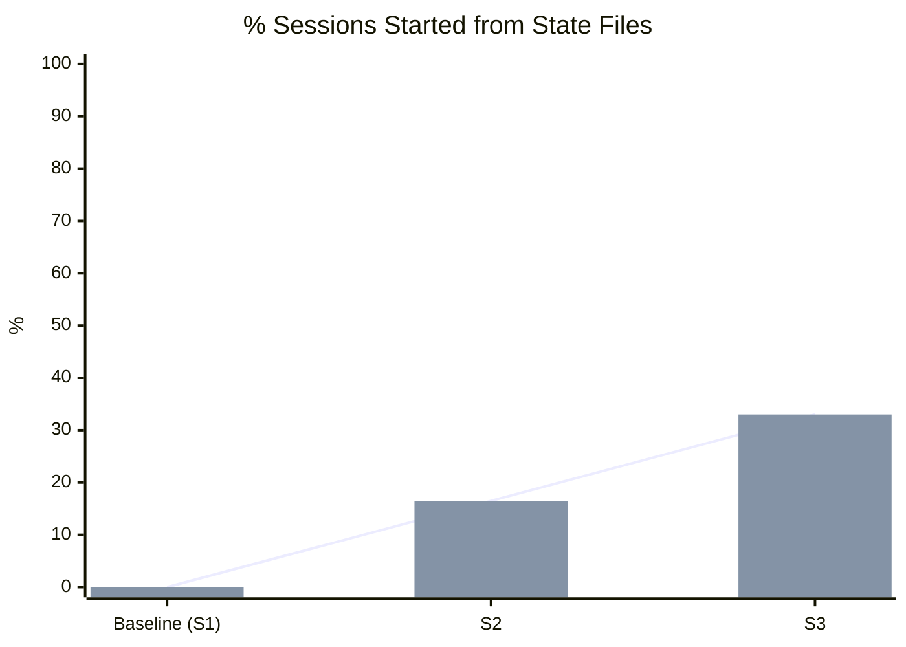
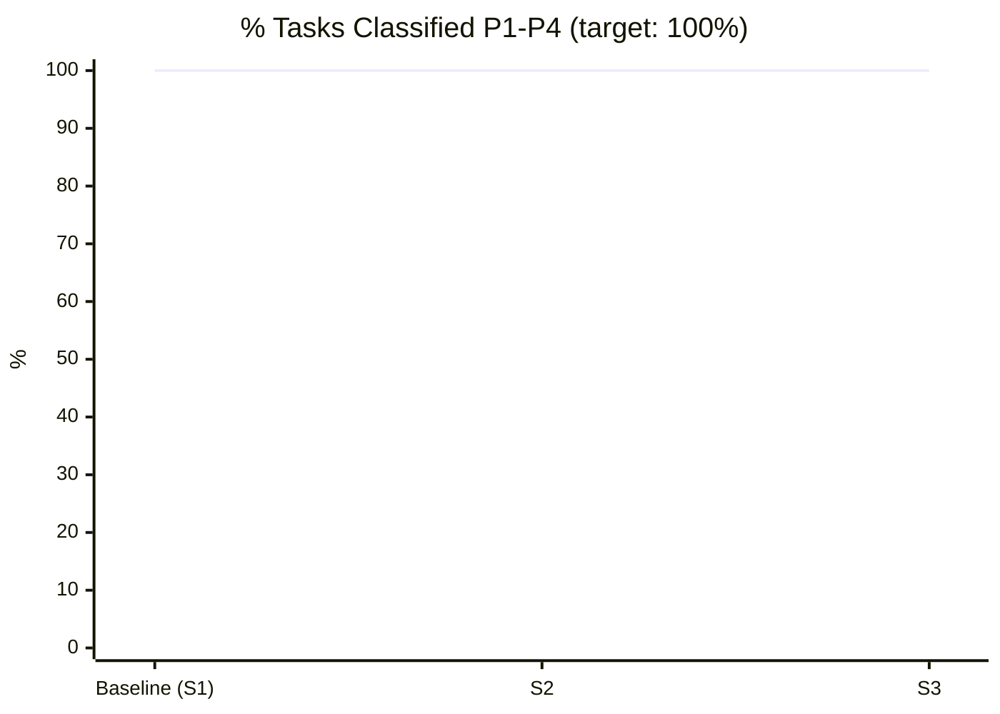
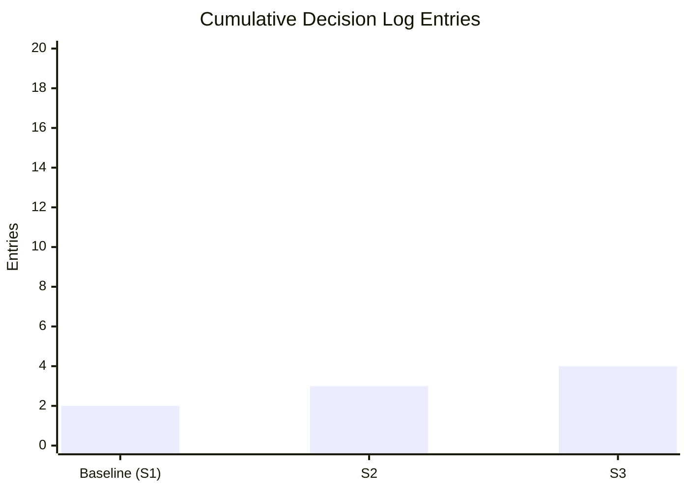
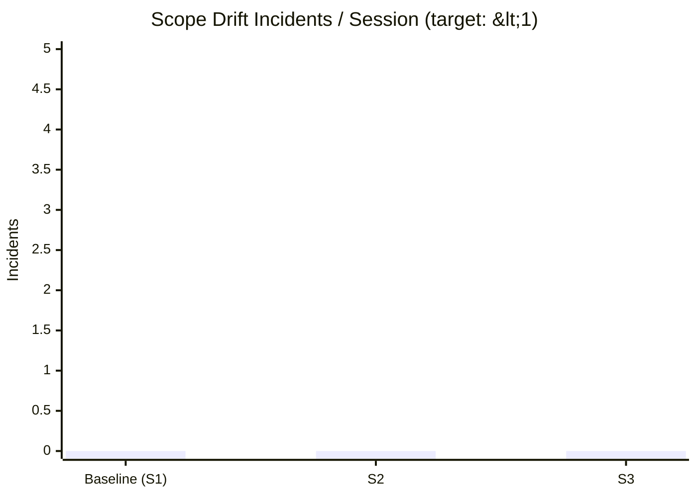

# KPI Dashboard — chromatic-harness-v2

> Auto-generated by `python scripts/generate_dashboard.py`
> Source: `05_REPORTS/KPI_SCORECARD.md` · Last update: 2026-05-31 · Sessions: 3

## Session Coverage Trend

## Task Classification Health

## Decision Log Volume

## Scope Drift

## KPI Summary Table

| KPI | Baseline | Target | Latest | Trend |
|-----|---------|--------|--------|-------|
| % sessions from state files | 0% | 80% | 33% | ↑ |
| % tasks classified P1-P4 | 100% | 100% | 100% | → |
| % P4 items parked | N/A | 95% | N/A | — |
| Decision log entries | 2 | 90%/session | 4 | ↑ |
| Scope drift / session | 0 | <1 | 0 | → |
| Broken governance files | 0 | 0 | 0 | → |

## Notes

- Trend arrows: ↑ improving · → stable · ↓ regressing · — no data
- Dashboard refreshes when `generate_dashboard.py` runs at sprint close
- xychart-beta requires GitHub Mermaid v10+ to render
