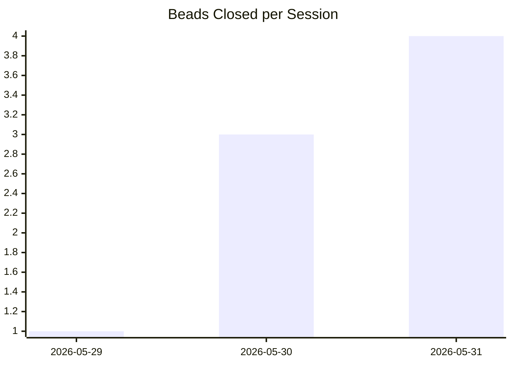
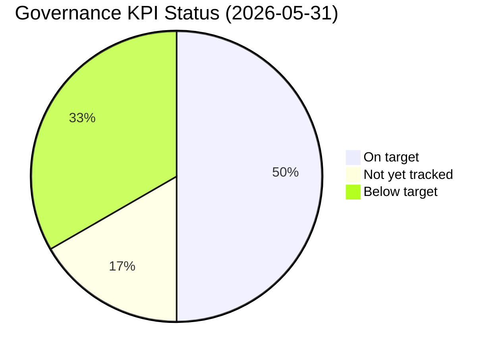

# KPI Trends

## Session Cadence

## Governance Health

## KPI Detail

| KPI | Baseline | Target | Current | Status |
|-----|---------|--------|---------|--------|
| % sessions started from state files | 0% | 80% | 33% | Below target |
| % tasks classified P1-P4 | 100% | 100% | 100% | On target |
| % P4 items parked (not worked) | N/A | 95% | N/A | Not yet tracked |
| % actions logged to decision log | 2 entries | 90% | 4 entries | Below target |
| Scope drift incidents / session | 0 | <1 | 0 | On target |
| Broken governance files | 0 | 0 | 0 | On target |

_Data sourced from `05_REPORTS/KPI_SCORECARD.md` and `05_REPORTS/telemetry.jsonl`. Last updated: 2026-05-31._
