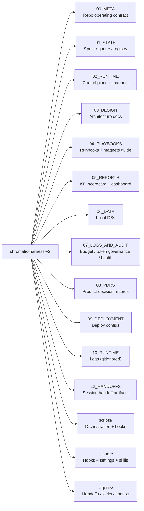
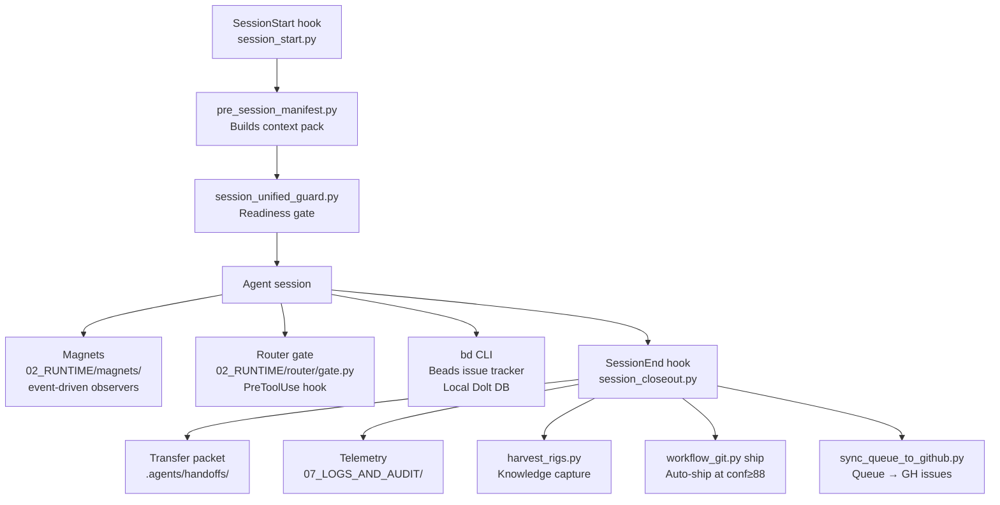
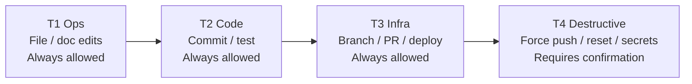

# Chromatic Harness v2 — Repo Structure Map

> Regenerate dashboard: `python scripts/generate_dashboard.py`

## Directory Architecture

```mermaid
graph LR
    root["chromatic-harness-v2"]

    root --> meta["00_META\nRepo operating contract"]
    root --> state["01_STATE\nSprint / queue / registry"]
    root --> runtime["02_RUNTIME\nControl plane + magnets"]
    root --> design["03_DESIGN\nArchitecture docs"]
    root --> playbooks["04_PLAYBOOKS\nRunbooks + magnets guide"]
    root --> reports["05_REPORTS\nKPI scorecard + dashboard"]
    root --> data["06_DATA\nLocal DBs"]
    root --> audit["07_LOGS_AND_AUDIT\nBudget / token governance / health"]
    root --> pdrs["08_PDRS\nProduct decision records"]
    root --> deploy["09_DEPLOYMENT\nDeploy configs"]
    root --> runtime2["10_RUNTIME\nLogs (gitignored)"]
    root --> handoffs["12_HANDOFFS\nSession handoff artifacts"]
    root --> scripts["scripts/\nOrchestration + hooks"]
    root --> claude[".claude/\nHooks + settings + skills"]
    root --> agents[".agents/\nHandoffs / locks / context"]
```

## Runtime Data Flow

```mermaid
graph TD
    boot["SessionStart hook\nsession_start.py"] --> manifest["pre_session_manifest.py\nBuilds context pack"]
    manifest --> guard["session_unified_guard.py\nReadiness gate"]
    guard --> agent["Agent session"]

    agent --> magnets["Magnets\n02_RUNTIME/magnets/\nevent-driven observers"]
    agent --> router["Router gate\n02_RUNTIME/router/gate.py\nPreToolUse hook"]
    agent --> bd["bd CLI\nBeads issue tracker\nLocal Dolt DB"]

    agent --> closeout["SessionEnd hook\nsession_closeout.py"]
    closeout --> handoff["Transfer packet\n.agents/handoffs/"]
    closeout --> telemetry["Telemetry\n07_LOGS_AND_AUDIT/"]
    closeout --> harvest["harvest_rigs.py\nKnowledge capture"]
    closeout --> autoship["workflow_git.py ship\nAuto-ship at conf≥88"]
    closeout --> queueSync["sync_queue_to_github.py\nQueue → GH issues"]
```

## Governance Layers

```mermaid
graph LR
    t1["T1 Ops\nFile / doc edits\nAlways allowed"]
    t2["T2 Code\nCommit / test\nAlways allowed"]
    t3["T3 Infra\nBranch / PR / deploy\nAlways allowed"]
    t4["T4 Destructive\nForce push / reset / secrets\nRequires confirmation"]

    t1 --> t2 --> t3 --> t4
```
