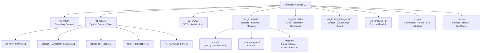

# Chromatic Harness v2 — Repo Map

```mermaid
graph TD
    ROOT[chromatic-harness-v2]
    ROOT --> META[00_META\nOperating Contract]
    ROOT --> STATE[01_STATE\nSprint · Queue · Risks]
    ROOT --> DOCS[02_DOCS\nSOPs · Architecture]
    ROOT --> RUNTIME[02_RUNTIME\nRouters · Engines · Magnets]
    ROOT --> REPORTS[05_REPORTS\nKPIs · Telemetry · Scorecard]
    ROOT --> LOGS[07_LOGS_AND_AUDIT\nBudget · Governance · Guard]
    ROOT --> HANDOFFS[12_HANDOFFS\nSession Handoffs]
    ROOT --> SCRIPTS[scripts/\nAutomation · Hooks · KPI collectors]
    ROOT --> CLAUDE[.claude/\nSettings · Hooks · Workflows]

    RUNTIME --> ROUTER[router/\ngate.py · model routing]
    RUNTIME --> ENGINES[runtime-engines/\nroach-pi]
    RUNTIME --> MAGNETS[magnets/\nClosureMagnet · ContextPressure]

    STATE --> SPRINT[SPRINT_STATE.md]
    STATE --> QUEUE[AGENT_HANDOFF_QUEUE.md]
    STATE --> DECISIONS[DECISION_LOG.md]
    STATE --> RISKS[RISK_REGISTER.md]
    STATE --> P4[P4_PARKING_LOT.md]
```
