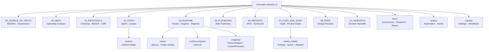

# Chromatic Harness v2 — Repo Map

> **Structural source of truth:** [`CHROMATIC_TREES.md`](../CHROMATIC_TREES.md) (operation→file map, legacy paths).
> This diagram is a high-level overview only.

## Review intake (harness-native paths)

| Artifact | Path |
|----------|------|
| Findings JSONL | `07_LOGS_AND_AUDIT/review_intake/findings.jsonl` |
| Work queue | `07_LOGS_AND_AUDIT/review_intake/queue.json` |
| State | `07_LOGS_AND_AUDIT/review_intake/state.json` |
| PDR | `08_PDRS/PDR_REVIEW_INTAKE_2026-06-01.md` |

See [`07_LOGS_AND_AUDIT/audits/repo_reorg_audit_2026-06-01.md`](../07_LOGS_AND_AUDIT/audits/repo_reorg_audit_2026-06-01.md) for zip→harness path mapping.
