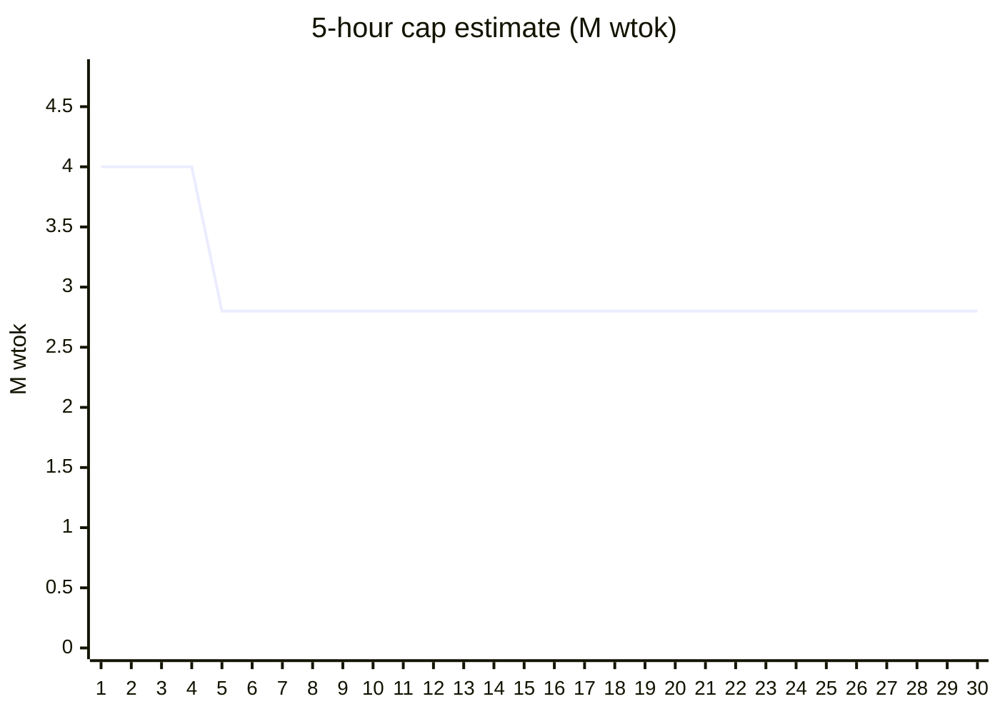
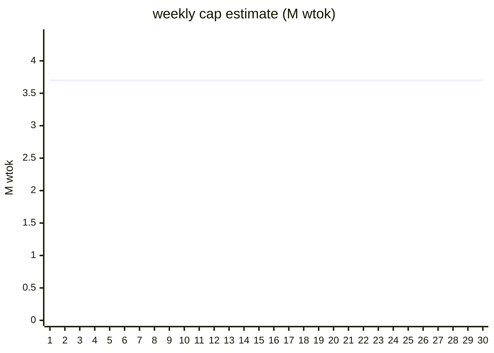
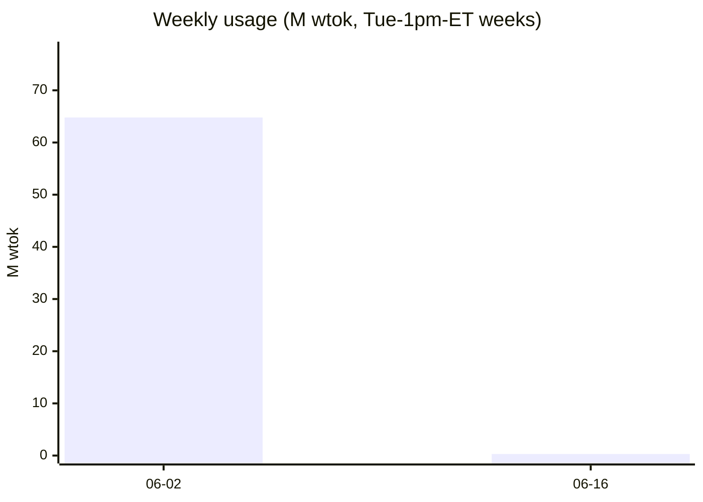

# Usage Calibration Dashboard

> Auto-generated by `python scripts/usage_dashboard.py`
> Updated: 2026-06-16T23:40:50.987783+00:00 · Epoch: e1 · Weights: 2026-06-pricing
> Caps derived from logged usage vs Anthropic's native rate-limit % (snapshot-delta).
> Unit: weighted tokens (wtok), sonnet-input = 1.0.

## Current Windows

| Window | Used | Cap | Confidence | Forecast |
|--------|------|-----|-----------|----------|
| 5-hour | 303k | 2.8M | prov | — |
| weekly | 303k | 3.7M | prov | — |

## 5-hour Cap Calibration Trend

## Weekly Cap Calibration Trend

## Weekly Usage (rollup)

## Monthly Usage

| Month | Usage | Events |
|-------|-------|--------|
| 2026-06 | 65.1M | 896 |

## Epoch Timeline

| Epoch | Opened | Reason |
|-------|--------|--------|
| e1 ◀ current | 2026-06-03T21:09:29 | init |

---
- Provisional caps (small sample) are hidden from the statusline used/cap until "ok".
- A new epoch opens when a firm cap shifts >40% for 3 consecutive runs (limit change).
- xychart-beta requires GitHub Mermaid v10+ to render.
