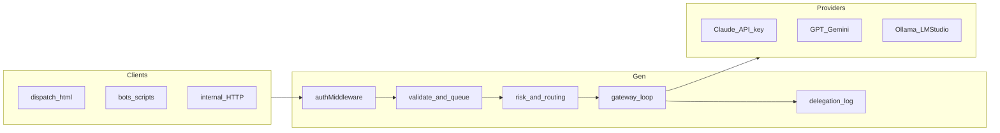

# Model dispatch gateway (Gen — Track A)

**Audience:** Operators and implementers aligning **server-side** LLM traffic with one policy-first path.

This document is the **target contract** for [Track A](#two-tracks) (Gen-hosted `generate()`-style work). It complements [DISPATCH-AND-ORCHESTRATION-REFERENCE.md](DISPATCH-AND-ORCHESTRATION-REFERENCE.md) (two planes, hooks, front door) and does **not** replace [gen/README.md](../../gen/README.md) or [GEN-OTEL.md](../agent-observability/GEN-OTEL.md).

## Two tracks

| Track | Scope | Status in this repo |
|-------|--------|---------------------|
| **A — Gen-hosted gateway** | Any LLM completion initiated **by Gen** (HTTP `/api/delegate`, internal callers you route through it). | **Implemented:** multi-provider `ILlmClient`, queue, fallback chain, `delegation_log` SQLite. **Mounted** on running Gen (see [gen/src/index.ts](../../gen/src/index.ts)). |
| **B — IDE primary chat proxy** | Claude Code (or similar) **main** model loop proxied through Gen (Messages API, tools, streaming, billing). | **Not in scope** here — separate product epic. Today Plane A uses Gen **hooks** only; the primary reasoner still talks to the vendor path directly. See [Track B epic](#track-b-optional-epic-claude--ide-primary-loop-proxy). |

## Normalized request envelope (optional fields)

Clients **should** send a stable envelope so analytics and future policy can slice by tenant without schema churn. All fields are **optional**; the gateway remains backward compatible.

| Field | Role |
|-------|------|
| `repo` | Repository or workspace identifier (low cardinality preferred). |
| `userId` | Stable user or actor id (never PII unless your policy allows). |
| `sessionId` | Correlates with hook `sessionId` when the same job spans hooks + delegate. |
| `taskIntent` | Offline-first routing key. When it matches an entry in [`gen/src/routes/routing-matrix.json`](../../gen/src/routes/routing-matrix.json), `POST /api/delegate` uses that **ordered probe chain** (per-step `localModelTag` for `ollama` / `gemma` overrides `GEN_OLLAMA_MODEL` / `GEN_GEMMA_OLLAMA_MODEL` for that attempt only). If omitted or unknown, routing falls back to `LlmSelector` + cost-ordered chain. **If `preferredProvider` is set, the matrix is skipped** (forced provider / legacy chain). Canonical keys: `classify-route`, `prompt-normalize`, `policy-risk-check`, `code-small-edit`, `code-complex-refactor`, `architecture-decision`, `test-generation`, `review-summary`, `longform-final-user-answer`, `vision-triage`. |
| `riskLevel` | `low` \| `medium` \| `high` — informs future policy tiers. |
| `toolContext` | Free-text or JSON string naming the triggering tool or workflow step. |
| `workflowType` | `interactive` (default) \| `background` — see [Fail-open vs fail-closed](#fail-open-vs-fail-closed). |

The HTTP API echoes provided envelope fields under `requestEcho` on success and on **background** degraded responses.

## Policy order (Track A)

For **`POST /api/delegate`**, the effective order is:

1. **Transport auth** — [`authMiddleware`](../../gen/src/middleware/auth.ts): valid `GEN_TOKEN` (fail-closed if misconfigured).
2. **Request validation** — prompt required, max length, known `role` if set.
3. **Queue / backpressure** — [`DelegateQueue`](../../gen/src/context/delegate-queue.ts): capacity and timeout (fail-closed with 429/504 when appropriate).
4. **Content / task risk** — NSFW path heuristics from prompt and `task.filePaths` (feeds `LlmTask.nsfwContext` before routing).
5. **Routing** — optional **`taskIntent` → routing matrix** ([`routing-matrix.json`](../../gen/src/routes/routing-matrix.json)); otherwise `LlmSelector` + cost-ordered probe chain. VRAM guard filters Ollama/Gemma steps when unsafe; Ollama readiness uses the **per-step** model tag when present.
6. **Model call** — `ILlmClient.generate()` for the chosen provider.
7. **Output validation** — `FallbackPolicy` may trigger try-next-provider.
8. **Persistence** — each attempt recorded in **`delegation_log`** with a **single `trace_id` per HTTP job** (all attempts share one id).

Hooks (`/hooks/*`) remain a **separate** policy surface (budget, path guard, Hop). They apply to the IDE path, not automatically to `/api/delegate` unless you add explicit budget checks later.

## Fail-open vs fail-closed

| `workflowType` | When all providers are exhausted | HTTP |
|----------------|-----------------------------------|------|
| **`interactive`** (default) | Fail-closed | **503** with `lastError`, `fallbackChain`, `traceId`. |
| **`background`** | Fail-open | **200** with `result: ""`, `degraded: true`, `failureMode: "fail_open"`, plus `traceId` and error hint for batch consumers. |

Batch jobs should use `background` only when empty results are safe to interpret downstream.

## Tier-2 assistants (bypass the gateway today)

These call **Ollama or local helpers directly** for latency and simplicity. They are **not** behind `/api/delegate` until refactored. Each must either be migrated to the gateway or kept exempt with shared observability elsewhere (hooks OTEL, logs).

| Component | File | Behavior |
|-----------|------|----------|
| Ollama triage | [`gen/src/ollama/ollama-triage.ts`](../../gen/src/ollama/ollama-triage.ts) | Direct `OllamaClient.generate` for ingest/triage prompts. |
| Verbal formatter (TTS prep) | [`gen/src/tts/verbal-formatter.ts`](../../gen/src/tts/verbal-formatter.ts) | Direct Ollama for speech-friendly text. |
| Planning gate | [`gen/src/planning/planning-gate.ts`](../../gen/src/planning/planning-gate.ts) | Optional `GEN_ENABLE_PLANNING=true`; uses `generateJSON` on Ollama, not delegate. |

**Rule:** New Gen features that need **multi-provider** or **fallback** should call **`POST /api/delegate`** (or an internal wrapper around the same code path), not new `ILlmClient` call sites.

## Unified observability

- **SQLite:** `delegation_log` — attempts, `failure_reason`, `fallback_note`, **`trace_id`** links all attempts for one job.
- **JSONL:** [`gen-audit.jsonl`](../../gen/logs/gen-audit.jsonl) — hook and policy events (Plane A).
- **OTEL:** When `OTEL_EXPORTER_OTLP_ENDPOINT` is set, follow [GEN-OTEL.md](../agent-observability/GEN-OTEL.md) for span attribute policy.

Daily rollup: from repo root, `python gen/scripts/diagnose_gen_observability.py --daily-delegate --db gen/gen.db` (adjust DB path). Full report: omit `--daily-delegate`. For automation or high-impact routing changes, use the human gate in [BEST-PRACTICES-HEALTH.md](../operations/BEST-PRACTICES-HEALTH.md).

## API entrypoints

| Method | Path | Role |
|--------|------|------|
| POST | `/api/delegate` | Run prompt through gateway (queue + fallback). |
| GET | `/api/delegate/status` | Provider probe snapshot. |
| GET | `/api/delegate/queue` | Queue depth and capacity. |
| GET | `/api/delegate/roles` | `roles.json` registry. |
| GET | `/api/delegate/services` | Local companion probes (ComfyUI, Ollama, LM Studio, …). |
| GET | `/api/delegate/sysinfo` | Host metrics for dispatch UI. |
| GET | `/api/sandbox-ol/health` | Sandbox-OL bridge health and script resolution. |
| GET | `/api/sandbox-ol/agents` | Allowlisted sandbox agent ids for OL delegation. |
| POST | `/api/sandbox-ol/delegate` | Delegate a prompt to a sandbox agent runner (Python bridge). |

## Mermaid — Track A data flow

## Track B (optional epic): Claude / IDE primary loop proxy

**Goal:** No direct app-to-model for the **main** agentic loop; Gen terminates TLS, enforces policy, unifies telemetry, and implements tool/streaming compatibility.

**Why separate:** Requires Message API parity, streaming, tool schemas, session state, and operational ownership of latency and billing. Track A can ship first and remains the pattern for **offloaded** work (`/api/delegate`) and **non-IDE** automation.

**Prerequisites (draft):** threat model, SLO targets, kill-switch at proxy, explicit mapping from subscription vs API-key Claude, and alignment with [DISPATCH-AND-ORCHESTRATION-REFERENCE.md](DISPATCH-AND-ORCHESTRATION-REFERENCE.md) correlation IDs.

## See also

- [BEST-PRACTICES-HEALTH.md](../operations/BEST-PRACTICES-HEALTH.md) — preflight, audit skim, hook-change gate.
- [DISPATCH-AND-ORCHESTRATION-REFERENCE.md](DISPATCH-AND-ORCHESTRATION-REFERENCE.md) — Plane A vs B, `sessionId`, Hop.
- [gen/docs/INTENT-LLM-ROUTING.md](../../gen/docs/INTENT-LLM-ROUTING.md) — pretool routing hints vs delegate offload.
