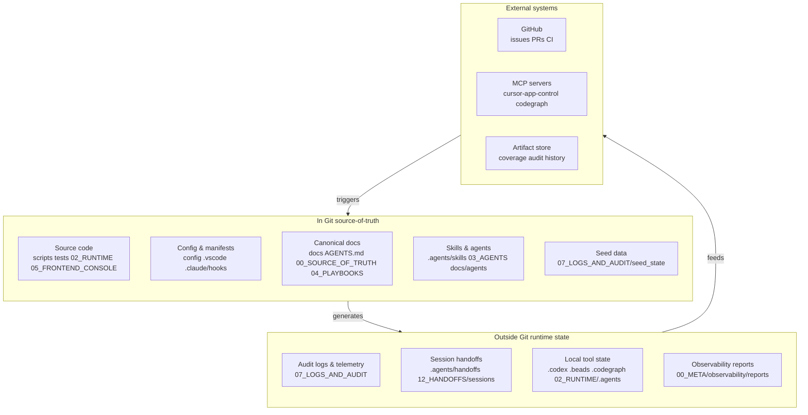
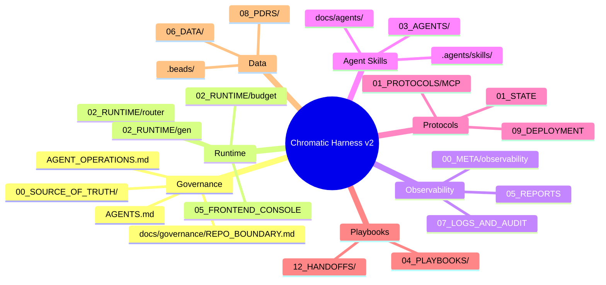
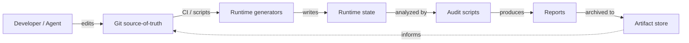

# Chromatic Harness v2 — Architecture & Boundary Maps

## Layer diagram

```mermaid
flowchart TB
    subgraph Git[In Git source-of-truth]
        direction TB
        SRC[Source code\nscripts tests 02_RUNTIME 05_FRONTEND_CONSOLE]
        CFG[Config & manifests\nconfig .vscode .claude/hooks]
        DOCS[Canonical docs\ndocs AGENTS.md 00_SOURCE_OF_TRUTH 04_PLAYBOOKS]
        SKILLS[Skills & agents\n.agents/skills 03_AGENTS docs/agents]
        SEED[Seed data\n07_LOGS_AND_AUDIT/seed_state]
    end

    subgraph Runtime[Outside Git runtime state]
        direction TB
        LOGS[Audit logs & telemetry\n07_LOGS_AND_AUDIT]
        HAND[Session handoffs\n.agents/handoffs 12_HANDOFFS/sessions]
        LOCAL[Local tool state\n.codex .beads .codegraph 02_RUNTIME/.agents]
        META[Observability reports\n00_META/observability/reports]
    end

    subgraph External[External systems]
        GH[GitHub\nissues PRs CI]
        MCP[MCP servers\ncursor-app-control codegraph]
        ART[Artifact store\ncoverage audit history]
    end

    Git -->|generates| Runtime
    Runtime -->|feeds| External
    External -->|triggers| Git
```

## Concern map

```mermaid
mindmap
  root((Chromatic Harness v2))
    Governance
      AGENTS.md
      AGENT_OPERATIONS.md
      docs/governance/REPO_BOUNDARY.md
      00_SOURCE_OF_TRUTH/
    Runtime
      02_RUNTIME/router
      02_RUNTIME/budget
      02_RUNTIME/gen
      05_FRONTEND_CONSOLE
    Observability
      07_LOGS_AND_AUDIT
      00_META/observability
      05_REPORTS
    Agent Skills
      .agents/skills/
      03_AGENTS/
      docs/agents/
    Protocols
      01_PROTOCOLS/MCP
      01_STATE
      09_DEPLOYMENT
    Playbooks
      04_PLAYBOOKS/
      12_HANDOFFS/
    Data
      06_DATA/
      08_PDRS/
      .beads/
```

## Git vs runtime boundary

```mermaid
graph LR
    A[Developer / Agent] -->|edits| B[Git source-of-truth]
    B -->|CI / scripts| C[Runtime generators]
    C -->|writes| D[Runtime state]
    D -->|analyzed by| E[Audit scripts]
    E -->|produces| F[Reports]
    F -->|archived to| G[Artifact store]
    G -.->|informs| B
```
