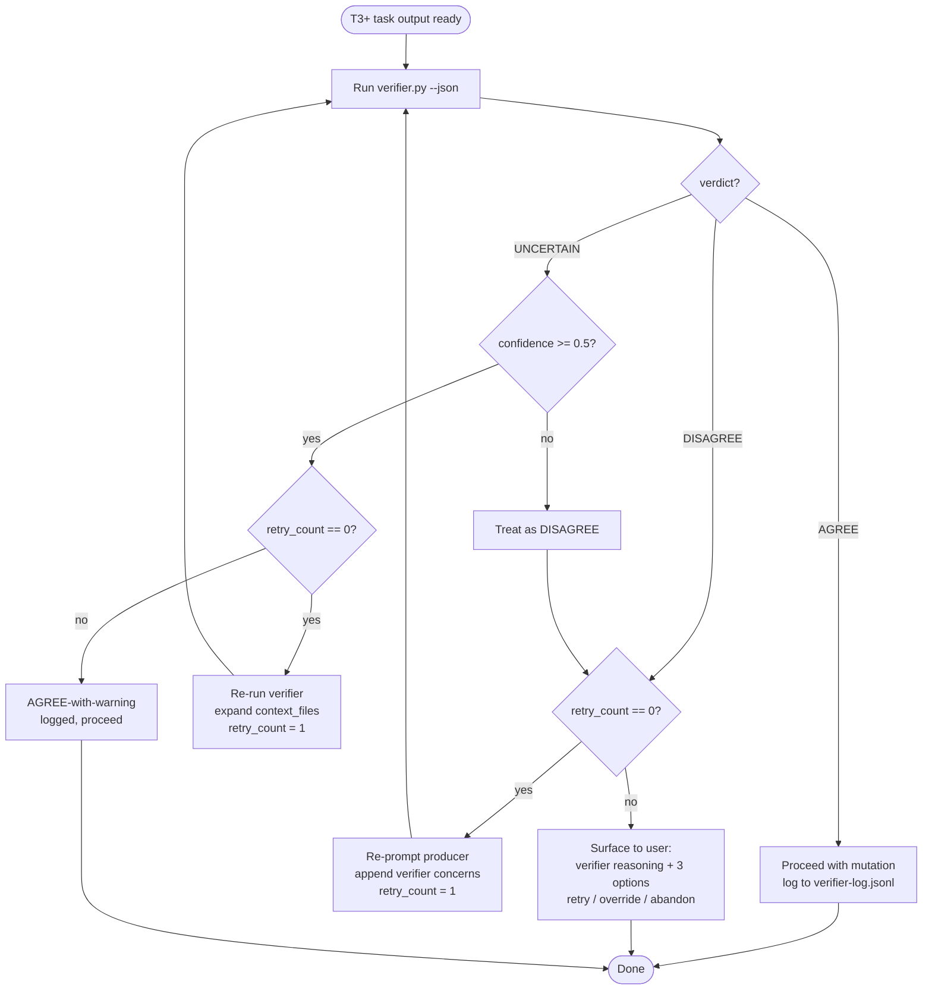

# Verifier Escalation Flow (Sprint 4 / S4.3)

How the system reacts to each verifier verdict. Companion to the invocation rule in `CLAUDE.md` (`## Verifier (T3+ Invocation Rule)`).

## Decision tree



## Retry rules

1. Maximum **1 retry** per task, regardless of verdict path. No exponential backoff, no recursion.
2. On DISAGREE retry: producer is re-prompted with the verifier's `specific_concerns` appended verbatim. The retry path is `DISAGREE -> retry -> re-verify`. A second DISAGREE goes to user.
3. On UNCERTAIN-with-confidence retry: verifier is re-invoked with an expanded `context_files` set (peer files, parent docs, related tests). Producer is **not** re-prompted.
4. `retry_count` is the only loop counter. It increments by 1 per re-invocation and is logged on every verdict.
5. UNCERTAIN with `confidence < 0.5` is normalized to DISAGREE *before* the retry counter is consulted, so it gets the DISAGREE retry path (producer re-prompt), not the UNCERTAIN path (context expansion).

## Logging contract

Every verdict appends one JSON line to `~/.agents/verifier-log.jsonl`:

```json
{"ts":"2026-05-01T12:00:00Z","task_id":"t-abc123","tier":"T3","verdict":"AGREE","confidence":0.91,"retry_count":0,"action_taken":"proceed"}
```

Required fields: `ts`, `task_id`, `tier`, `verdict`, `confidence`, `retry_count`, `action_taken`.

`action_taken` enum: `proceed | proceed_with_warning | retry_producer | retry_expanded_context | surface_to_user | bypass | skipped`.

## Edge cases

- **Verifier timeout / crash:** synthesize `verdict=UNCERTAIN, confidence=0.0`. Per the tree this becomes a DISAGREE → producer re-prompt. If the *retried* call also times out, surface to user with `action_taken=surface_to_user` and a `timeout=true` flag in the log line.
- **Verifier returns malformed JSON:** treat exactly as timeout (UNCERTAIN/0.0). Do not attempt local parsing heuristics.
- **Producer output changes between verify and mutate:** the verifier verdict is invalidated; re-verify before mutation. This does not consume the retry budget.
- **Skipped tasks** (whitelist match): log `verdict=SKIPPED, action_taken=skipped, retry_count=0` with the whitelist reason in `specific_concerns`.

## Operator override

`VERIFIER_BYPASS=true` env var skips verifier invocation entirely. When set, a single log line is written *before* mutation:

```json
{"ts":"...","task_id":"...","tier":"T3","verdict":"BYPASS","confidence":null,"retry_count":0,"action_taken":"bypass","justification":"<one-line reason>"}
```

`justification` is mandatory. A bypass with empty justification is rejected at the wrapper layer and falls back to normal verification. Bypass is audited via `verifier_kpi.py`'s `bypass_count`.
