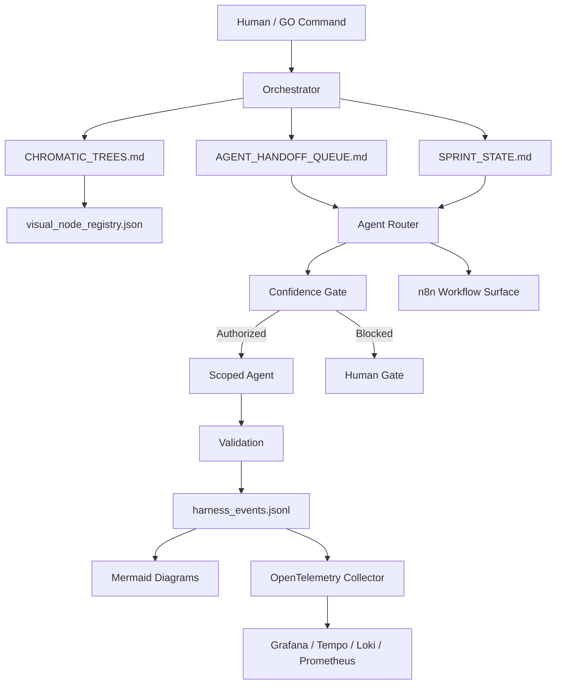

# PDR: Chromatic Harness Visual Control Plane

| Field | Value |
|---|---|
| PDR ID | CHVCP-001 |
| Status | Draft / Ready for Implementation |
| Owner | Human Owner + Orchestrator |
| Applies To | Claude, ChatGPT, Cursor, VS Code, Codex, local agents, n8n, GitHub Actions |
| Version | 0.1.0 |
| Last Updated | 2026-05-30 |

## 1. Executive Summary

Build a portable visual control plane for the Chromatic Harness so each repo can show its architecture, workflows, agent routing, confidence gates, telemetry, and active queues in a way that works across Claude, Cursor, VS Code, GitHub Markdown, n8n, and observability dashboards.

This is not a replacement for `CHROMATIC_TREES.md`. It is the visual and operational overlay that makes the harness inspectable.

## 2. Problem Statement

The harness can contain many layers: repo tree rules, agents, playbooks, workflows, queues, model routing, automation, validation, and observability. Without visual maps and machine-readable registries, agents and humans drift into rediscovery, tool abuse, broad searches, duplicated docs, and unclear authority.

## 3. Objectives

1. Show static system structure through Mermaid and registry JSON.
2. Show active workflow execution through n8n-compatible workflow maps.
3. Show agent behavior through router graphs and trace events.
4. Show runtime health through OpenTelemetry-compatible event schemas.
5. Make the system portable across Claude, Cursor, VS Code, GitHub, and local agent runners.
6. Preserve `CHROMATIC_TREES.md` as the repo source of truth.

## 4. Non-Objectives

- Do not create a full custom web app in this PDR.
- Do not replace n8n, Grafana, LangGraph, or Backstage.
- Do not allow agents to mutate repo state without confidence scoring.
- Do not make IDE-specific rules the source of truth.

## 5. Core Architecture



## 6. Required Artifacts

| Artifact | Required | Purpose |
|---|---:|---|
| `docs/visuals/HARNESS_LAYER_MAP.md` | Yes | Static view of harness layers |
| `docs/visuals/GO_MODE_FLOW.md` | Yes | Autonomy flow and confidence gates |
| `docs/visuals/AGENT_ROUTER_GRAPH.md` | Yes | Agent and model routing view |
| `docs/visuals/OBSERVABILITY_PIPELINE.md` | Yes | Event, trace, metric, log flow |
| `schemas/visual_node.schema.json` | Yes | Machine-readable node definition |
| `schemas/harness_event.schema.json` | Yes | Standard telemetry event |
| `visual_node_registry.json` | Yes | Source for generated Mermaid |
| `scripts/generate_harness_mermaid.py` | Yes | Diagram generation |
| `.vscode/tasks.json` | Recommended | Run visual generation in VS Code |
| `.cursor/rules/*.mdc` | Recommended | Cursor-compatible agent rules |
| `.claude/CLAUDE.md` | Recommended | Claude-compatible repo instructions |

## 7. Adapter Requirements

### 7.1 Claude

Claude should read `.claude/CLAUDE.md` first, then defer to:

1. `CHROMATIC_TREES.md`
2. `docs/pdr/PDR_VISUAL_CONTROL_PLANE.md`
3. `docs/playbooks/VISUAL_CONTROL_PLANE_PLAYBOOK.md`
4. `visual_node_registry.json`
5. `AGENT_HANDOFF_QUEUE.md`

### 7.2 Cursor

Cursor rules must be thin bridge files. They should not duplicate governance. They should instruct Cursor agents to read the same source-of-truth files before editing.

### 7.3 VS Code

VS Code should expose tasks for:

- Generating Mermaid diagrams
- Validating JSON registries
- Opening visual docs
- Running basic repo-control checks

### 7.4 GitHub

GitHub should render Mermaid diagrams in Markdown and optionally run a validation workflow on PRs.

### 7.5 n8n

n8n should be treated as the visual workflow panel, not the governance brain. It may trigger workflows, receive webhooks, and update queue/status files through controlled APIs.

## 8. Confidence Gate

Every action that changes files, queue state, or external systems must include:

```json
{
  "confidence_score": 0,
  "risk_level": "unknown",
  "scope_clarity": 0,
  "evidence_quality": 0,
  "reversibility": "unknown",
  "decision": "halt"
}
```

Allowed behavior:

| Confidence | Band | Behavior |
|---:|---|---|
| 90-100 | Very High | Scoped autonomous execution allowed |
| 75-89 | High | Scoped execution allowed with logging |
| 60-74 | Medium | Reversible low-risk action only |
| 40-59 | Low | Plan only |
| 0-39 | Blocked | Halt and escalate |

## 9. Observability Contract

Every agent run should emit a JSONL event matching `schemas/harness_event.schema.json`.

Minimum fields:

- `event_id`
- `timestamp`
- `task_id`
- `agent`
- `model`
- `event_type`
- `confidence_score`
- `risk_level`
- `files_touched`
- `tools_used`
- `result`

## 10. Implementation Phases

### Phase 1: Static Visuals

- Add Mermaid docs.
- Add visual registry schema.
- Generate layer map from `visual_node_registry.json`.

### Phase 2: IDE Adapters

- Add Claude instructions.
- Add Cursor rules.
- Add VS Code tasks.

### Phase 3: Workflow Visibility

- Add n8n workflow map template.
- Add webhook event schema.
- Add queue-update contract.

### Phase 4: Runtime Observability

- Emit JSONL events.
- Add OpenTelemetry mapping.
- Add Grafana dashboard placeholder.

### Phase 5: Validation Gates

- Validate registry schema.
- Validate diagrams can regenerate.
- Validate every agent action has confidence metadata.

## 11. Acceptance Criteria

- [ ] User can open `docs/visuals/HARNESS_LAYER_MAP.md` and see the full harness structure.
- [ ] User can run `python scripts/generate_harness_mermaid.py` and generate Mermaid docs from registry JSON.
- [ ] Claude, Cursor, and VS Code adapters defer to `CHROMATIC_TREES.md`.
- [ ] Event schema supports later OpenTelemetry mapping.
- [ ] PDR includes phases, acceptance criteria, risks, and ownership.
- [ ] No IDE adapter becomes an independent source of truth.

## 12. Risks and Mitigations

| Risk | Impact | Mitigation |
|---|---|---|
| Docs drift from repo state | High | Generate diagrams from registry JSON |
| Cursor/Claude rules duplicate governance | Medium | Bridge-only adapter files |
| Agents overuse tools | High | Confidence gate and tool budgets |
| n8n becomes uncontrolled execution brain | High | Use n8n as workflow surface only |
| Observability is too heavy early | Medium | Start with JSONL, map to OpenTelemetry later |

## 13. Decision

Proceed with a portable visual-control scaffold that can be copied into any Chromatic Harness repo and adapted incrementally.
