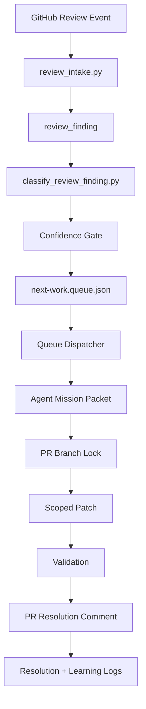

# Dependency Graph

```mermaid
graph TD
  A[GitHub Review Event] --> B[review_intake.py]
  B --> C[review_finding]
  C --> D[classify_review_finding.py]
  D --> E[Confidence Gate]
  E --> F[next-work.queue.json]
  F --> G[Queue Dispatcher]
  G --> H[Agent Mission Packet]
  H --> I[PR Branch Lock]
  I --> J[Scoped Patch]
  J --> K[Validation]
  K --> L[PR Resolution Comment]
  L --> M[Resolution + Learning Logs]
```
