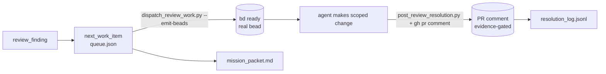

# Review Intake — Live Wiring (OMH-4)

Bead: `chromatic-harness-v2-w1bf.4` — *Wire review-intake live (comments back)*.
Epic: `chromatic-harness-v2-w1bf` — Operating-Model Hardening (OMH).

This closes the review-intake loop **end-to-end against a real PR**, not a fixture:

1. a real review finding becomes a governed queue item,
2. `dispatch_review_work.py --emit-beads` dispatches it and registers a **real bead**
   so the finding enters the live `bd ready` loop,
3. the agent makes the scoped change, then
4. `post_review_resolution.py` emits an **evidence-gated** resolution comment that is
   posted **back to the PR** via `gh pr comment`.

The two halves (`--emit-beads` and comments-back) were built and unit-proven in the
PDR re-engineer (see [ACCEPTANCE_PROOF.md](ACCEPTANCE_PROOF.md), AC4/AC6). What was
missing — and what OMH-4 adds — is a **live run on a real PR** demonstrating the loop
closes without manual JSON surgery.

## The loop, live



### Step 1 — dispatch with bead emission

```bash
python scripts/dispatch_review_work.py \
  --queue 07_LOGS_AND_AUDIT/review_intake/queue.json \
  --emit-beads --limit 1
```

`--emit-beads` calls `create_bead()` which shells out to `bd create` with the finding's
risk/confidence mapped to a bd priority (`_bd_priority`), labels it `review-intake`, and
back-fills `bead_id` onto the queue item (idempotent — a re-run does not double-create).
The dispatch record (`dispatch_log.jsonl`) carries the `bead_id`, `lock_id`, and the
rendered `mission_packet` path. One mutating agent per PR is enforced by
`lock_pr_branch.acquire`.

### Step 2 — resolution comment back to the PR

```bash
python scripts/post_review_resolution.py \
  --finding <RF> --task <NW> --agent Auditor \
  --status Resolved \
  --files docs/pdr/review_intake/LIVE_WIRING.md \
  --validation "python -m pytest tests/test_review_intake_acceptance.py -q" \
  | gh pr comment <PR> --body-file -
```

`post_review_resolution.py` **rejects a `Resolved` status that lacks evidence** (at least
one changed file AND one validation command, AC6) before any comment is printed, then
appends a schema-valid `review_resolution` record to `resolution_log.jsonl`.

## Captured live run

<!-- LIVE_RUN_CAPTURE -->
Run on **PR [#208](https://github.com/kas1987/chromatic-harness-v2/pull/208)** (`kas1987/chromatic-harness-v2`), 2026-06-02:

| Artifact | Value |
|----------|-------|
| Queue item | `NW-OMH4LIVE01` (finding `RF-OMH4LIVE01`) |
| Dispatch record | `AD-3784E38B55CB` |
| Bead emitted (`--emit-beads`) | `chromatic-harness-v2-f2it` → entered `bd ready`, then closed (demonstration) |
| Resolution comment | [PR #208 issuecomment-4604073711](https://github.com/kas1987/chromatic-harness-v2/pull/208#issuecomment-4604073711) |
| Resolution record | `RR-75F017C80F68` (status `Resolved`, evidence-gated) |

**Bug found and fixed during the live run.** `--emit-beads` was a silent no-op on
Windows: `create_bead` gated on `shutil.which("bd")` (which resolves `bd.CMD`) but then
ran `subprocess.run(["bd", ...])` with the *bare* name, and `CreateProcess` does not apply
`PATHEXT`, so it raised `FileNotFoundError` → caught → degraded to packet-only with no
bead. Fixed by executing the which-resolved absolute path. Locked by a regression
assertion in `test_dispatch_emits_bead_into_live_loop`. This is precisely what a "wire it
**live**" task surfaces that fixture tests (which monkeypatch `subprocess.run`) cannot.
<!-- /LIVE_RUN_CAPTURE -->

## Why self-referential

The live run targets the OMH-4 PR itself: the *finding* is this wiring task, the *change*
is this branch, and the *validation* is the review-intake acceptance suite. Every field in
the posted comment is therefore truthful — the demonstration does not post a fabricated
resolution onto an unrelated PR. The demonstration bead is closed after the run so the
tracker is not polluted with a synthetic work item.
