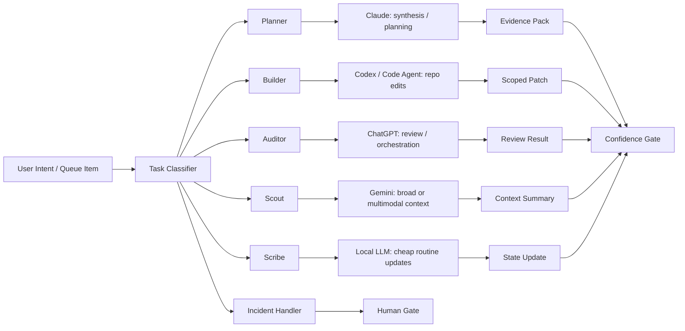

# Agent Router Graph

## Routing notes

Use specialization, not popularity:

- Claude: long synthesis, careful docs, strategy.
- ChatGPT: orchestration, structured review, tool-aware planning.
- Codex/code agents: patches, tests, refactors.
- Gemini: broad context and multimodal comparison.
- Local models: cheap classification, summarization, queue triage.
