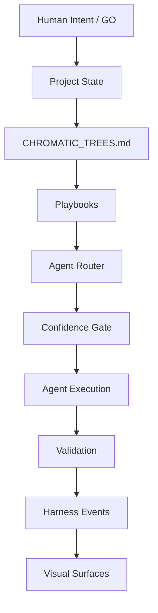

# Generated Harness Layer Map

Generated from `visual_node_registry.json`. Do not hand-edit this file unless you also update the registry.

```mermaid
flowchart TD
    human_intent["Human Intent / GO"]
    project_state["Project State"]
    chromatic_trees["CHROMATIC_TREES.md"]
    playbooks["Playbooks"]
    agent_router["Agent Router"]
    confidence_gate["Confidence Gate"]
    agent_execution["Agent Execution"]
    validation["Validation"]
    events["Harness Events"]
    visual_surfaces["Visual Surfaces"]
    human_intent --> project_state
    project_state --> chromatic_trees
    chromatic_trees --> playbooks
    playbooks --> agent_router
    agent_router --> confidence_gate
    confidence_gate --> agent_execution
    agent_execution --> validation
    validation --> events
    events --> visual_surfaces
```
