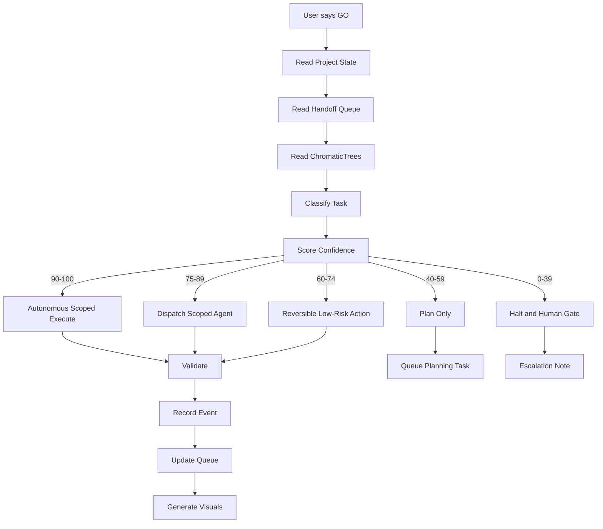

# GO-Mode Flow

## Required GO-mode files

- `SPRINT_STATE.md`
- `AGENT_HANDOFF_QUEUE.md`
- `CHROMATIC_TREES.md`
- `DECISION_LOG.md`
- `RISK_REGISTER.md`
- `docs/playbooks/VISUAL_CONTROL_PLANE_PLAYBOOK.md`
