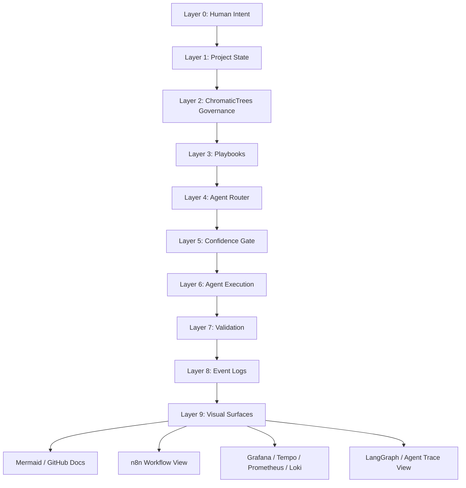

# Harness Layer Map

This diagram shows the full visual operating stack.

## Interpretation

- `CHROMATIC_TREES.md` governs repo structure.
- Playbooks govern behavior.
- Router selects the agent or model.
- Confidence gate authorizes or blocks action.
- Execution produces events.
- Events feed visual surfaces.
