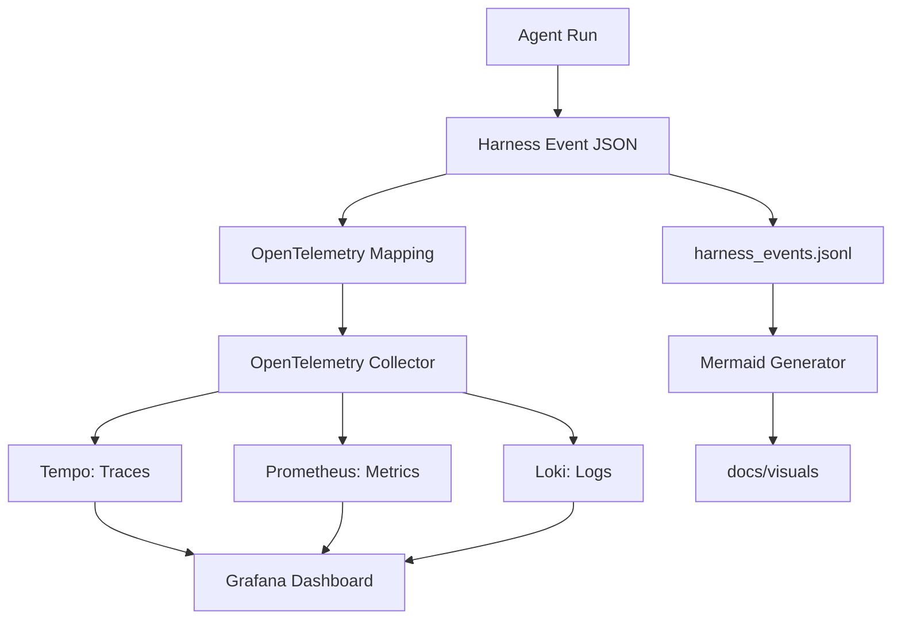

# Observability Pipeline

## Minimum event fields

- `event_id`
- `timestamp`
- `task_id`
- `agent`
- `model`
- `event_type`
- `confidence_score`
- `risk_level`
- `tools_used`
- `files_touched`
- `result`
