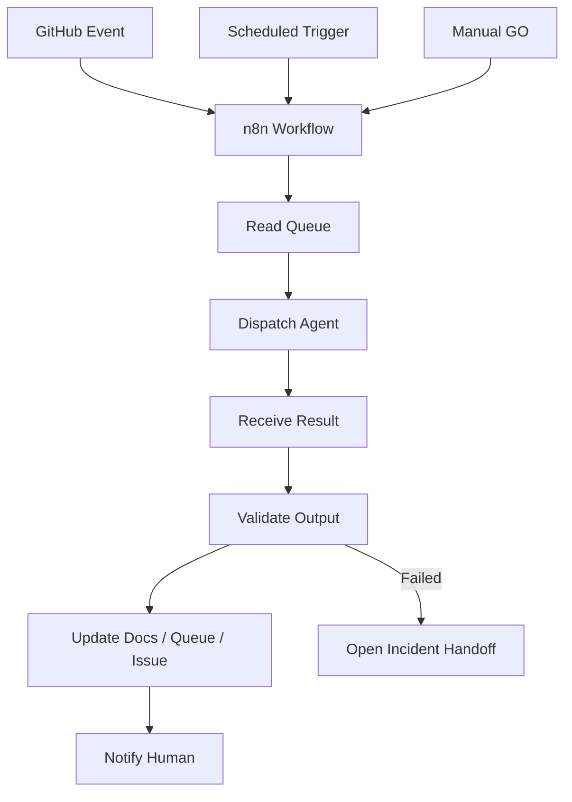

# Workflow Surface Map

```mermaid
flowchart TD
    GH[GitHub Event] --> N8N[n8n Workflow]
    Schedule[Scheduled Trigger] --> N8N
    Manual[Manual GO] --> N8N

    N8N --> Queue[Read Queue]
    Queue --> Dispatch[Dispatch Agent]
    Dispatch --> Result[Receive Result]
    Result --> Validate[Validate Output]
    Validate --> Update[Update Docs / Queue / Issue]
    Update --> Notify[Notify Human]

    Validate -->|Failed| Incident[Open Incident Handoff]
```

## Boundary rule

n8n may orchestrate workflow events, but governance remains in ChromaticTrees, playbooks, confidence gates, and human gates.
