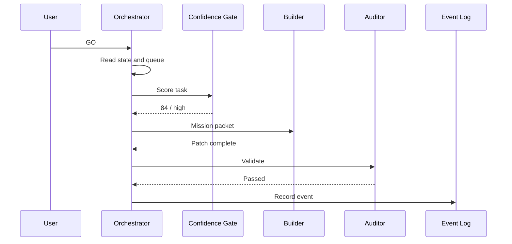

# Simple Agent Trace Example

```mermaid
sequenceDiagram
    participant User
    participant Orchestrator
    participant Gate as Confidence Gate
    participant Builder
    participant Auditor
    participant Log as Event Log

    User->>Orchestrator: GO
    Orchestrator->>Orchestrator: Read state and queue
    Orchestrator->>Gate: Score task
    Gate-->>Orchestrator: 84 / high
    Orchestrator->>Builder: Mission packet
    Builder-->>Orchestrator: Patch complete
    Orchestrator->>Auditor: Validate
    Auditor-->>Orchestrator: Passed
    Orchestrator->>Log: Record event
```
